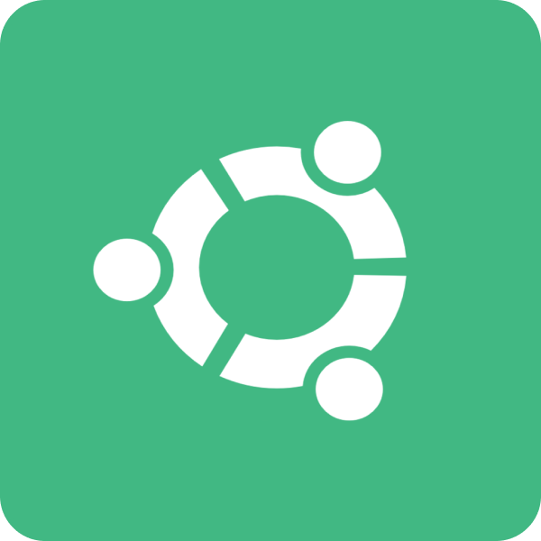

<h3>Hello, I'm Michael!</h3>

I am a dedicated Mobile and Web based programmer with a keen interest in: Kotlin and Javascript. I particularly enjoy Front-End development as I love designing and creating UX/UI.

  <h4>My Languages & Technologies</h4>
  
  
  
  
  
  

<h4>What I'm Working On</h4>

Currently I am working on a mobile application called 'World Scape' this allowing one to capture details about worlds or universes in literature or to allow one to create their own worlds. I am creating this due to having a personal interest in creating my own stories, with this allowing me to keep all my ideas in one place.

<h4>Technologies I am Learning</h4>

I am actively improving my knowledge in the React framework to extend my knowledge in web based programming. I am also learning more about machine learning by utilising TensorFlow due to having an interest in machine learning and wanting to know more about how to practically implement this.

<h4>How to Reach Me</h4>

	
	<a href="https://www.linkedin.com/in/michaelwoodroof/">
		
	<a/>

<!-- Stats -->
<!-- Credit to https://github.com/anuraghazra/github-readme-stats -->

	<h4>Stats</h4>
    
    

