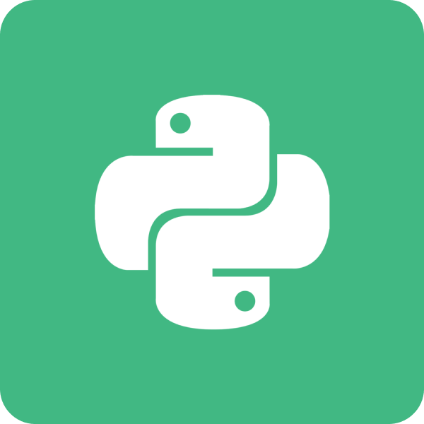

<h3>Hello, I'm Michael!</h3>

I am a dedicated mobile programmer with a keen interest in Kotlin. I particularly enjoy frontend development as I love designing and creating.

  <h4>My Languages & Technologies</h4>
  
  
  
  

<h4>Technologies I am Learning</h4>

I am actively improving my knowledge in the React framework to extend my knowledge in web based programming. I am also learning more about machine learning by utilising TensorFlow due to having an interest in machine learning and wanting to know more about how to practically implement this.

<h4>How to Reach Me</h4>

	
	<a href="https://www.linkedin.com/in/michaelwoodroof/">
		
	<a/>

